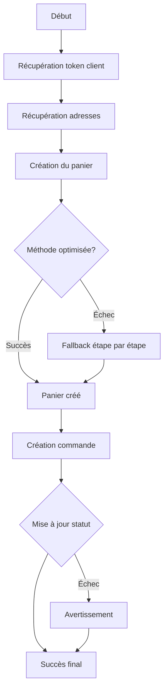

Voici une documentation complète pour votre code de service de checkout :

---

# 📚 Documentation Complète du Service Checkout

## 🎯 Vue d'Ensemble

Le service `checkout.service.ts` est un module complet de gestion du processus de commande pour une application PrestaShop. Il gère la création de panier, l'ajout de produits, et la finalisation de commande via l'API PrestaShop.

---

## 📋 Table des Matières

1. [Configuration par Défaut](#configuration-par-défaut)
2. [Interfaces et Types](#interfaces-et-types)
3. [Fonctions Utilitaires](#fonctions-utilitaires)
4. [Création du Panier](#création-du-panier)
5. [Création de la Commande](#création-de-la-commande)
6. [Processus Principal de Checkout](#processus-principal-de-checkout)
7. [Fonctions Auxiliaires](#fonctions-auxiliaires)
8. [Gestion des Erreurs](#gestion-des-erreurs)

---

## ⚙️ Configuration par Défaut

### `DEFAULT_CONFIG`

```typescript
const DEFAULT_CONFIG = {
  CUSTOMER_ID: '1',           // ID client par défaut
  CUSTOMER_TOKEN: '',         // Token d'authentification (géré dynamiquement)
  ADDRESS_DELIVERY_ID: '1',   // ID adresse de livraison
  ADDRESS_INVOICE_ID: '1',    // ID adresse de facturation
  CARRIER_ID: '1',            // ID du transporteur
  PAYMENT_METHOD: 'paiement_livraison',       // Méthode de paiement
  PAYMENT_MODULE: 'ps_cashondelivery',        // Module de paiement
  CURRENCY_ID: '1',           // ID de la devise (EUR par défaut)
  LANG_ID: '1',              // ID de la langue (Français)
  ORDER_STATE: '13',         // État de commande (En attente de paiement)
};
```

**⚠️ Important :** Ces valeurs sont des fallbacks. En production, elles devraient être remplacées par des valeurs dynamiques.

---

## 🏗️ Interfaces et Types

### `CartProduct`
```typescript
export interface CartProduct {
  product_id: string;              // ID du produit (obligatoire)
  quantity: number;                // Quantité commandée
  id_product_attribute?: string;   // ID de déclinaison (optionnel)
  name?: string;                   // Nom du produit (informatif)
  price?: string;                  // Prix unitaire (informatif)
  image_url?: string;              // URL de l'image (informatif)
}
```

### `CartData`
```typescript
export interface CartData {
  products: CartProduct[];         // Liste des produits à commander
  customerId?: string;             // ID client (surcharge)
  carrierId?: string;              // ID transporteur (surcharge)
  paymentMethod?: string;          // Méthode de paiement (surcharge)
}
```

---

## 🔧 Fonctions Utilitaires

### `fetchCustomerAddresses()`

**Objectif :** Récupère les adresses d'un client depuis l'API PrestaShop.

```typescript
const fetchCustomerAddresses = async (customerId: string): Promise<{
  deliveryId: string;
  invoiceId: string;
}>
```

**Fonctionnement :**
1. Appelle l'API PrestaShop pour obtenir les adresses du client
2. Parse la réponse XML
3. Extrait la première adresse trouvée
4. Utilise les valeurs par défaut en cas d'échec

**Exemple d'utilisation :**
```typescript
const { deliveryId, invoiceId } = await fetchCustomerAddresses('123');
```

**Gestion des erreurs :**
- Si aucune adresse n'est trouvée → Valeurs par défaut (`'1'`)
- Si erreur réseau → Valeurs par défaut (`'1'`)

---

## 🛒 Création du Panier

### `buildCartWithProductsXml()`

**Objectif :** Construit le XML pour créer un panier avec ses produits en une seule requête.

```typescript
const buildCartWithProductsXml = (
  customerId: string,
  customerToken: string,
  products: CartProduct[],
  deliveryAddressId: string,
  invoiceAddressId: string
): string
```

**Structure XML générée :**
```xml
<?xml version="1.0" encoding="UTF-8"?>
<prestashop xmlns:xlink="http://www.w3.org/1999/xlink">
  <cart>
    <id_currency>1</id_currency>
    <id_lang>1</id_lang>
    <id_customer>123</id_customer>
    <id_carrier>1</id_carrier>
    <id_address_delivery>5</id_address_delivery>
    <id_address_invoice>5</id_address_invoice>
    <associations>
      <cart_rows>
        <cart_row>
          <id_product>45</id_product>
          <id_product_attribute>0</id_product_attribute>
          <id_address_delivery>5</id_address_delivery>
          <id_customization>0</id_customization>
          <quantity>2</quantity>
        </cart_row>
      </cart_rows>
    </associations>
  </cart>
</prestashop>
```

### `createCartWithProducts()` - Méthode Optimisée

**Objectif :** Crée un panier avec tous les produits en une seule requête API (recommandé).

```typescript
const createCartWithProducts = async (
  customerId: string,
  customerToken: string,
  products: CartProduct[],
  deliveryAddressId: string,
  invoiceAddressId: string
): Promise<string>
```

**Avantages :**
- ✅ Une seule requête API
- ✅ Plus rapide pour des commandes multiples
- ✅ Évite les problèmes de synchronisation

**Processus :**
1. Construit le XML complet avec tous les produits
2. Envoie une requête POST à `/carts`
3. Récupère l'ID du panier créé
4. Retourne l'ID du panier

### `createCartStepByStep()` - Méthode Fallback

**Objectif :** Crée un panier étape par étape si la méthode optimisée échoue.

```typescript
const createCartStepByStep = async (
  customerId: string,
  customerToken: string,
  products: CartProduct[],
  deliveryAddressId: string,
  invoiceAddressId: string
): Promise<string>
```

**Processus :**
1. **Étape 1 :** Crée un panier vide
2. **Étape 2 :** Ajoute chaque produit un par un

**Inconvénients :**
- ❌ Multiple requêtes API
- ❌ Plus lent
- ❌ Risque d'état incohérent en cas d'échec

**Quand l'utiliser :**
- Automatiquement si `createCartWithProducts()` échoue
- Pour le débogage si l'API a des limitations

---

## 📋 Création de la Commande

### `createOrderWithSchema()`

**Objectif :** Transforme un panier en commande validée avec gestion avancée des erreurs.

```typescript
const createOrderWithSchema = async (
  cartId: string,
  customerId: string,
  customerToken: string,
  paymentMethod: string
): Promise<any>
```

**Fonctionnalités :**

1. **Récupération des totaux :** Obtient les montants du panier
2. **Construction du XML :** Crée le XML de commande complet
3. **Gestion des erreurs 500 :** Mécanisme intelligent de récupération

**Gestion spéciale des erreurs 500 :**

```
Si erreur 500 → La commande est probablement créée quand même
                → Recherche automatique de la commande créée
                → Vérification avec l'ID du panier
                → Mise à jour du statut forcée
```

**Algorithme de récupération :**
1. Attend 2 secondes après l'erreur
2. Recherche les 5 dernières commandes du client
3. Compare l'ID du panier
4. Si non trouvé → Attente supplémentaire de 2 secondes
5. Si toujours non trouvé → Retourne un succès simulé

**Retour :**
```typescript
{
  id: string,        // ID de la commande
  cartId: string,    // ID du panier associé
  total: string,     // Montant total
  warning?: string   // Message d'avertissement si récupération
}
```

### `updateOrderState()`

**Objectif :** Change le statut d'une commande de manière robuste.

```typescript
const updateOrderState = async (orderId: string, newState: string)
```

**Fonctionnement :**
1. Tente de récupérer la commande complète
2. Met à jour uniquement `current_state` et `valid`
3. Si échec → Utilise un XML minimal
4. Si échec → Nouvelle tentative après 1 seconde

**Statuts PrestaShop courants :**
- `'1'` : En attente de paiement
- `'2'` : Paiement accepté
- `'3'` : Préparation en cours
- `'13'` : En attente de paiement (utilisé ici)

---

## 🚀 Processus Principal de Checkout

### `processCheckout()`

**Objectif :** Orchestrer le processus complet de checkout du début à la fin.

```typescript
export const processCheckout = async (cartData: CartData): Promise<any>
```

**Flow complet :**



**Étapes détaillées :**

1. **Authentification**
   ```typescript
   const { getCustomerId, getCustomerToken } = useAuth();
   const customerId = cartData.customerId || getCustomerId();
   const customerToken = getCustomerToken();
   ```

2. **Récupération des adresses**
   ```typescript
   const addresses = await fetchCustomerAddresses(customerId);
   ```

3. **Création du panier avec fallback**
   ```typescript
   try {
     cartId = await createCartWithProducts(...);
   } catch {
     cartId = await createCartStepByStep(...);
   }
   ```

4. **Finalisation de la commande**
   ```typescript
   const order = await createOrderWithSchema(cartId, ...);
   ```

5. **Validation du statut**
   ```typescript
   if (order.id && order.id !== 'unknown') {
     await updateOrderState(order.id, '13');
   }
   ```

**Exemple d'utilisation :**
```typescript
const result = await processCheckout({
  products: [
    { product_id: '45', quantity: 2 },
    { product_id: '78', quantity: 1 }
  ],
  customerId: '123',
  paymentMethod: 'paiement_livraison'
});

console.log(result);
// {
//   success: true,
//   cartId: '456',
//   order: { id: '789', total: '59.90', status: '13' },
//   customerId: '123',
//   addresses: { deliveryId: '5', invoiceId: '5' },
//   message: 'Commande créée avec succès'
// }
```

---

## 🛠️ Fonctions Auxiliaires

### `getCustomerInfo()`

**Objectif :** Récupère les informations détaillées d'un client.

```typescript
export const getCustomerInfo = async (
  customerId: string = DEFAULT_CONFIG.CUSTOMER_ID
): Promise<any>
```

**Retour :**
```typescript
{
  id: string,
  email: string,
  firstname: string,
  lastname: string
}
```

### `getDefaultCarrier()`

**Objectif :** Récupère les informations du transporteur par défaut.

```typescript
export const getDefaultCarrier = async (): Promise<any>
```

**Retour :**
```typescript
{
  id: string,
  name: string,   // ex: "Transporteur standard"
  delay: string   // ex: "Livraison standard"
}
```

---

## 🔐 Authentification

### Intégration avec `useAuth()`

Le service utilise un hook d'authentification pour récupérer :
- L'ID du client connecté
- Le token de sécurité

```typescript
const { getCustomerId, getCustomerToken } = useAuth();
```

---

## ⚠️ Gestion des Erreurs

### Stratégies de gestion

1. **Erreurs réseau → Fallback aux valeurs par défaut**
   ```typescript
   catch (error) {
     return { deliveryId: '1', invoiceId: '1' };
   }
   ```

2. **Erreurs 500 lors de la création de commande → Récupération automatique**
   ```typescript
   if (error.response?.status === 500) {
     // Recherche de la commande créée
   }
   ```

3. **Échec de création de panier → Méthode alternative**
   ```typescript
   try {
     // Méthode optimisée
   } catch {
     // Méthode étape par étape
   }
   ```

### Types d'erreurs gérées

| Type d'erreur | Comportement |
|--------------|--------------|
| Token manquant | Erreur fatale - Arrêt du processus |
| Adresse non trouvée | Fallback aux valeurs par défaut |
| Erreur 500 commande | Recherche automatique |
| Échec création panier | Méthode alternative |
| Échec mise à jour statut | 2 tentatives, puis ignore |

---

## 📊 Logs et Debugging

Le service inclut un système de logs complet avec emojis :

- 🚀 Démarrage de processus
- 🔑 Authentification
- 📍 Récupération d'adresses
- 🛒 Création de panier
- 📋 Création de commande
- ✅ Succès
- ❌ Erreurs
- ⚠️ Avertissements
- 🔍 Recherche de commande

---

## 🎯 Bonnes Pratiques Implémentées

1. **Résilience :** Fallbacks multiples en cas d'échec
2. **Performance :** Méthode optimisée avec fallback
3. **Traçabilité :** Logs détaillés à chaque étape
4. **Validation :** Vérification de l'ID commande/panier
5. **Statut :** Forçage automatique du statut de commande
6. **Simplicité :** Interface unifiée pour le processus complet

---

## 📝 Exemples d'Utilisation

### Exemple 1 : Checkout simple
```typescript
const order = await processCheckout({
  products: [
    { product_id: '45', quantity: 2 }
  ]
});
```

### Exemple 2 : Avec adresse cliente
```typescript
const order = await processCheckout({
  products: [
    { product_id: '45', quantity: 2, id_product_attribute: '8' }
  ],
  customerId: '123',
  carrierId: '2',
  paymentMethod: 'cheque'
});
```

### Exemple 3 : Récupération d'infos client
```typescript
const customer = await getCustomerInfo('123');
console.log(`Bonjour ${customer.firstname} ${customer.lastname}`);
```

---

## 🔄 Cycle de Vie Complet

```
1. Client s'authentifie → Token stocké
2. Parcourt les produits → Ajoute au panier virtuel
3. Valide son panier → processCheckout()
4. Système crée le panier PrestaShop → createCart
5. Système transforme en commande → createOrder
6. Statut mis à jour → updateOrderState
7. Confirmation envoyée au client
```

---

## 📦 Dépendances

- `../api/api` : Instance Axios configurée pour l'API PrestaShop
- `../services/useAuth` : Hook d'authentification
- **APIs externes :** PrestaShop Web Service

---

## 🚨 Notes Importantes

1. **Les tokens sont obligatoires** pour la création de commande
2. **La méthode optimisée** peut ne pas fonctionner avec certaines versions de PrestaShop
3. **Le statut 13** doit correspondre à un état valide dans votre configuration
4. **Les IDs par défaut** (1) doivent exister dans votre installation PrestaShop
5. **Le parsing XML** est nécessaire car l'API PrestaShop utilise majoritairement XML

---

Cette documentation couvre l'ensemble des fonctionnalités de votre service checkout. Pour toute modification, assurez-vous de maintenir la cohérence des fallbacks et la gestion robuste des erreurs qui caractérisent ce service.